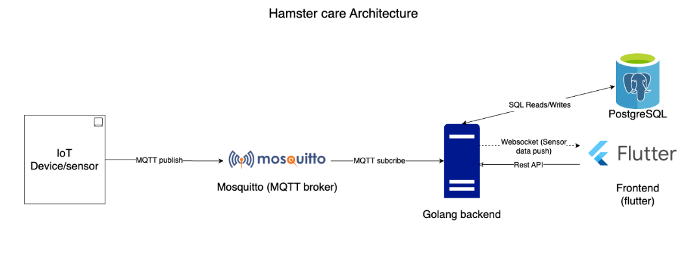

# HamstersCare Project - Software Engineering Course (HCMUT)

This is a project for the Software Engineering course at HCMUT.  
Our team is building a system called **HamstersCare**, which uses a YoloBit (ESP32-based board) to control and monitor a hamster's cage.

## System Features

1. **Control** the hamster's cage via a remote control.  
2. **Monitor** the hamster's cage through a mobile application.  
3. **Remotely control** the hamster's cage via the mobile application.

## My Responsibilities

- Building and setting up the hardware system.
- Setting up the Mosquitto MQTT broker.
- Developing the MQTT backend to handle communication between the hardware and the mobile app.

## Project Repository

You can find the full project at: [https://github.com/jncmtam/DADN-SE](https://github.com/jncmtam/DADN-SE)
